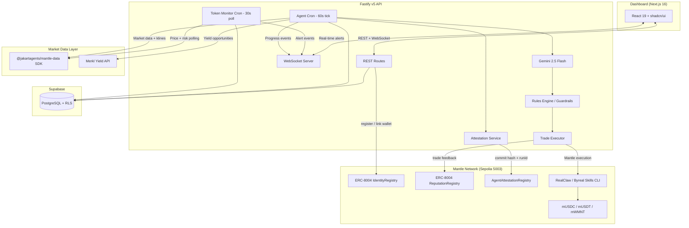

# JakartAgents 🤖

> Autonomous AI Agents for Mantle — Monitor, Analyze, Trade, Verify On-Chain

Built for **The Turing Test Hackathon 2026 (Mantle)** — Agentic Economy track.

## Overview

JakartAgents runs autonomous AI agents that monitor markets, generate trading signals with an LLM, validate them against user-defined guardrails, and execute on-chain. Every agent is registered as an ERC-8004 identity NFT on Mantle, and every run produces an attestation — a hash-anchored, timestamped record committed on-chain — so performance is independently verifiable rather than a black-box claim.

JakartAgents is also evolving into a no-code agent builder for Mantle, where trust comes from each agent's on-chain track record rather than marketing claims about performance.

The platform runs two agent types:

- **FX Agent** — trades stablecoin pairs based on macro news sentiment (USD strength/weakness, risk-on/risk-off).
- **Yield Agent** — hunts yield opportunities (via Merkl) and manages LP/vault positions.

Both agents share the same on-chain identity, reputation, and attestation infrastructure on **Mantle**.

## Mantle Integration

| Component | Status | Address (Mantle Sepolia, chainId 5003) |
|---|---|---|
| **ERC-8004 IdentityRegistry** | Live | `0x8004A818BFB912233c491871b3d84c89A494BD9e` |
| **ERC-8004 ReputationRegistry** | Live | `0x8004B663056A597Dffe9eCcC1965A193B7388713` |
| **AgentAttestationRegistry** (custom) | Deployed | `0x46ad38080a72011745e6dbbeddf0bdfc251676c6` |
| **mUSDC** (mock, testnet) | Deployed | `0xdf98ea1d6230f7aafc73fadebb373d7731c1bed8` |
| **mUSDT** (mock, testnet) | Deployed | `0x76eff439b3f57ab6bbe4e10f34a1f44c7f5332b3` |
| **mWMNT** (mock, testnet) | Deployed | `0x1fe6477783a5571e7259a5ad16293262b88779a3` |

Contract sources, deploy scripts, and verification: [`packages/contracts`](./packages/contracts).

- **Agent identity (ERC-8004)** — every FX/Yield agent registers on-chain via `IdentityRegistry.register()`, minting an agent NFT and linking the agent's execution wallet (`apps/api/src/services/agent-registry.ts`).
- **Reputation** — trade outcomes are submitted to `ReputationRegistry.giveFeedback()`, building an on-chain track record per agent.
- **On-chain attestations** — each agent run's timeline (signals, trades, tx hashes) is hashed and committed to `AgentAttestationRegistry` (`apps/api/src/services/attestation-service.ts`), giving every run a permanent, queryable on-chain anchor.
- **Mantle-native execution (in progress)** — Mantle swaps are routed through **RealClaw / Byreal Skills CLI**, the agent layer that sits in front of Merchant Moe / Agni Finance / Fluxion. The integration is scaffolded in `apps/api/src/services/realclaw-executor.ts`. Non-Mantle chains continue to use the existing market-data/execution SDK described below.

### Custody Model

Agent execution on Mantle is non-custodial via Privy through RealClaw. When agents auto-execute swaps, the platform routes the request through the Privy-managed execution flow and never stores or has access to users' raw private keys.

## Architecture



**Flow: Monitor → Analyze → Signal → Guardrails → Execute (Mantle) → Attest On-Chain → Track**

## Key Features

- 🔍 **Token Monitoring** — Watchlist, configurable price alerts, automated risk scoring (`apps/api/src/services/token-monitor.ts`)
- 🤖 **AI-Driven Signals** — Gemini 2.5 Flash analyzes market data + parallel news feeds to generate buy/sell/hold signals with confidence scores (0-100)
- ⚡ **On-Chain Execution** — Trades route through Mantle via RealClaw / Byreal Skills CLI
- 🆔 **ERC-8004 Agent Identity** — Every agent is an on-chain identity NFT with a linked execution wallet
- 📜 **On-Chain Attestations** — Every agent run's events are hashed and committed to `AgentAttestationRegistry` on Mantle
- 🛡️ **Smart Guardrails** — Daily trade limits, max allocation per token, max trade size caps, stop-loss protection
- 📊 **Real-Time Dashboard** — Live portfolio tracking, agent execution timeline, WebSocket streaming
- 🚨 **Contract Risk Check** — Transaction simulation / GoPlus checks on every watchlisted token

## Tech Stack

| Layer | Technology |
|---|---|
| Frontend | Next.js 16, React 19, Tailwind CSS v4, shadcn/ui |
| Backend | Fastify v5, TypeScript, Node.js 20 |
| AI | Gemini 2.5 Flash (via Vercel AI SDK) |
| On-chain (Mantle) | viem, ERC-8004 (Identity + Reputation), custom AgentAttestationRegistry |
| Mantle Execution | RealClaw / Byreal Skills CLI |
| Market Data | `@jakartagents/mantle-data` SDK + Merkl (yield) |
| Database | Supabase (PostgreSQL + Row Level Security) |
| Auth | SIWE (Sign-In With Ethereum) + JWT via thirdweb |
| Monorepo | pnpm workspaces + Turborepo |
| Testing | Vitest |

## Getting Started

### Prerequisites

- Node.js 20+
- pnpm 9.15+
- Supabase project (or local Supabase CLI)
- A wallet funded with Mantle Sepolia testnet MNT (faucet: https://faucet.sepolia.mantle.xyz)

### Install

```bash
pnpm install

# Set up environment variables
cp apps/api/.env.example apps/api/.env
# Fill in your API keys (see Environment Variables below)

# Push database migrations
pnpm supabase db push

# Start development servers (API + Web)
pnpm dev
```

The API server runs on `http://localhost:4000` and the web app on `http://localhost:3000`.

### Deploying / Re-deploying Contracts

```bash
pnpm --filter @jakartagents/contracts deploy:tokens                 # mUSDC / mUSDT / mWMNT
pnpm --filter @jakartagents/contracts deploy:attestation-registry   # AgentAttestationRegistry
pnpm --filter @jakartagents/contracts verify:registries             # sanity-check addresses in .env
```

## Environment Variables

### Mantle Network (`apps/api/.env`)

| Variable | Description |
|---|---|
| `MANTLE_NETWORK` | `testnet` (Mantle Sepolia, 5003) or `mainnet` (Mantle, 5000) |
| `MANTLE_RPC_URL` | RPC endpoint (default: `https://rpc.sepolia.mantle.xyz`) |
| `MANTLE_IDENTITY_REGISTRY_ADDRESS` | ERC-8004 IdentityRegistry address |
| `MANTLE_REPUTATION_REGISTRY_ADDRESS` | ERC-8004 ReputationRegistry address |
| `MANTLE_ATTESTATION_REGISTRY_ADDRESS` | AgentAttestationRegistry address |
| `MANTLE_USDC_ADDRESS` / `MANTLE_USDT_ADDRESS` / `MANTLE_WMNT_ADDRESS` | Mock token addresses (testnet) |
| `EVM_SIGNER_PRIVATE_KEY` | Server signer key for Mantle on-chain registration & transactions |
| `REALCLAW_API_BASE` / `REALCLAW_API_KEY` | RealClaw / Byreal Skills CLI execution layer for Mantle swaps |

### Core / Auth / Data

| Variable | Description |
|---|---|
| `THIRDWEB_SECRET_KEY` / `THIRDWEB_ADMIN_PRIVATE_KEY` | thirdweb auth + server wallets |
| `SUPABASE_URL` / `SUPABASE_SERVICE_ROLE_KEY` | Database |
| `MARKETDATA_API_KEY` | Market data SDK auth key (`@jakartagents/mantle-data`, AVE Cloud-backed — non-Mantle chains) |
| `MARKETDATA_DEFAULT_CHAIN` | Default chain for non-Mantle price queries (`bsc`, `eth`, `solana`, `base`) |
| `SOLANA_SIGNER_PRIVATE_KEY` | Solana signing key (non-Mantle execution path) |
| `PARALLEL_API_KEY` | News search (FX agent, Conversation Agent) |
| `XAI_API_KEY` | Grok social sentiment |
| `FIRECRAWL_API_KEY` | Governance scraping |
| `GEMINI_CLI_AUTH_TYPE` / `LLM_MODEL` | LLM auth + model selection |
| `DUNE_SIM_API_KEY` | Portfolio balances (falls back to direct Mantle reads via `lib/chains.ts`) |
| `ATTESTATION_SECRET` | HMAC signing secret for off-chain attestation payloads |
| `SELFCLAW_*` | Human-backed agent verification (proof-of-personhood) |

## Project Structure

```
jakartagents/
├── apps/
│   ├── api/                    # Fastify v5 backend
│   │   ├── src/
│   │   │   ├── routes/         # REST + WebSocket endpoints
│   │   │   ├── lib/
│   │   │   │   ├── chains.ts           # Mantle chain config (single source of truth)
│   │   │   │   └── chain-client.ts     # Mantle viem PublicClient
│   │   │   ├── abis/           # ERC-8004 + AgentAttestationRegistry ABIs
│   │   │   ├── services/
│   │   │   │   ├── token-monitor.ts        # Watchlist, alerts, 30s price poll
│   │   │   │   ├── price-service.ts        # Market data feeds + cache
│   │   │   │   ├── agent-registry.ts       # ERC-8004 register / reputation (Mantle)
│   │   │   │   ├── attestation-service.ts  # On-chain run attestations
│   │   │   │   ├── realclaw-executor.ts    # Mantle execution via RealClaw agent layer
│   │   │   │   ├── trade-executor.ts       # Multi-chain DEX trading
│   │   │   │   ├── agent-cron.ts           # 60s agent execution loop
│   │   │   │   ├── rules-engine.ts         # Trading guardrails
│   │   │   │   ├── llm-analyzer.ts         # Gemini 2.5 Flash analysis
│   │   │   │   └── news-fetcher.ts         # Parallel AI news search
│   │   │   └── tools/          # Conversation agent tools (market-data, etc.)
│   │   └── .env.example
│   └── web/                    # Next.js 16 frontend
│       └── src/app/
│           ├── (app)/monitor/  # Token watchlist + price alerts
│           ├── (app)/overview/ # Portfolio overview
│           ├── (app)/fx-agent/ # FX trading agent dashboard
│           ├── (app)/yield-agent/ # Yield agent dashboard
│           ├── (app)/agent-chat/  # Conversational AI agent
│           ├── (app)/swap/     # Manual token swap
│           └── (auth)/onboarding/ # Risk questionnaire + wallet setup
├── packages/
│   ├── mantle-data/            # Market data SDK (price/kline/holders/risk; non-Mantle chains)
│   │   └── src/
│   │       ├── client.ts       # HTTP client, auth, retry logic
│   │       ├── data-rest.ts    # Data endpoint wrappers
│   │       ├── trade-chain-wallet.ts  # Trade execution functions (non-Mantle)
│   │       └── types.ts
│   ├── contracts/               # Solidity contracts + deploy scripts (Mantle)
│   │   ├── contracts/
│   │   │   ├── AgentAttestationRegistry.sol
│   │   │   └── MockERC20.sol
│   │   └── scripts/             # deploy-*.ts, verify-registries.ts
│   ├── shared/                  # Shared TypeScript types
│   ├── db/                      # Supabase client factory + generated types
│   └── typescript-config/       # Shared tsconfig bases
├── supabase/
│   └── migrations/              # PostgreSQL migrations
├── turbo.json
├── pnpm-workspace.yaml
└── package.json
```

## Status / Roadmap

- ✅ ERC-8004 identity + reputation live on Mantle Sepolia
- ✅ AgentAttestationRegistry deployed; `attestation-service.ts` wiring to commit on-chain in progress
- 🚧 RealClaw/Byreal Skills CLI execution path (`realclaw-executor.ts`) — interface scaffolded, pending API integration
- 🚧 Yield vault adapters for Mantle-native vaults

## Team

**JakartAgents**

## License

MIT
